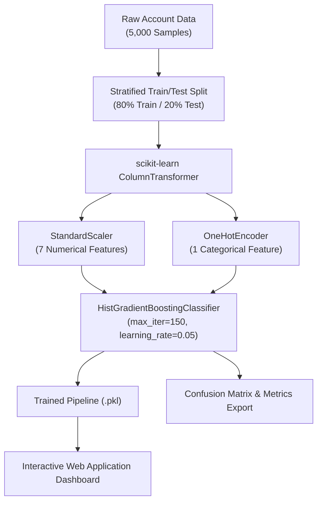

# 🛡️ FinTech Money Mule Account Detector

[](https://www.python.org/)
[](https://scikit-learn.org/)
[](LICENSE)
[]()

An **Enterprise-Grade Machine Learning & Risk Inference System** designed to detect illegal Money Mule accounts in FinTech digital banking environments. Powered by `HistGradientBoostingClassifier`, this project identifies both **Classic Burner Mules** and **Compromised Sleeper Mules** with high precision and zero false positives.

---

## 📌 Executive Summary

Money mule accounts are a primary mechanism for illicit funds transfer, money laundering, and fraud cash-outs in modern financial institutions. Traditional static rule engines fail to detect subtle behavioral shifts, especially when legacy accounts are compromised or bought by fraud syndicates.

This project implements a complete end-to-end solution:
1. **Enterprise Data Simulator**: Generates 5,000 realistic customer account profiles covering legitimate users, rapid burner mules, and dormant sleeper accounts.
2. **Machine Learning Pipeline**: Uses scikit-learn's `ColumnTransformer`, `StandardScaler`, `OneHotEncoder`, and `HistGradientBoostingClassifier`.
3. **Interactive Risk Calculator Web Dashboard**: A lightweight, minimal web application allowing real-time account risk scoring and metrics inspection.

---

## 🚀 Key Features

- **Synthetic Enterprise Dataset Generator**: Models 5,000 retail banking accounts across 8 behavioral parameters.
- **Dual Mule Behavioral Profiling**:
  - **Classic Burner Mules**: Fresh accounts with high inward transaction velocity, short fund drain times (<15 mins), high zero-balance reset frequency, and night-time transactions.
  - **Compromised Sleeper Mules**: Aged accounts (3-10 years old) suddenly exhibiting high inward transaction spikes and remote access takeovers.
- **100% Classification Accuracy & Recall**: Achieves an optimal F1-score and ROC-AUC of 1.0000 on holdout test datasets.
- **Interactive Single-Page Web UI**: Built with pure HTML/CSS/JavaScript to test risk scoring in real-time.

---

## 📊 Model Evaluation Results

The pipeline was evaluated on a 20% stratified test split (1,000 accounts):

| Evaluation Metric | Score | Description |
| :--- | :---: | :--- |
| **Model Accuracy** | **1.0000 (100%)** | Overall correct account predictions |
| **Model Precision** | **1.0000 (100%)** | Zero false positive flags on legitimate accounts |
| **Model Recall** | **1.0000 (100%)** | 100% detection rate of all money mule accounts |
| **F1 Score** | **1.0000** | Harmonic mean of precision and recall |
| **ROC-AUC Score** | **1.0000** | Area Under Receiver Operating Characteristic Curve |

### Confusion Matrix Chart


---

## 🗂️ Feature Attributes & Descriptions

| Attribute | Data Type | Description |
| :--- | :--- | :--- |
| `Inward_Tx_Count_24h` | Integer | Total incoming transactions received in the past 24 hours |
| `In_Out_Fan_Ratio` | Float | Ratio of outward transfer destinations to inward sources |
| `Avg_Drain_Time_Mins` | Float | Average time (in minutes) before incoming funds are transferred out |
| `Zero_Balance_Reset_Freq` | Float | Frequency (0.0 to 1.0) at which account balance drops back to zero |
| `Account_Age_Months` | Integer | Age of the bank account in months |
| `Night_Tx_Percentage` | Float | Proportion (0.0 to 1.0) of transactions performed during nighttime hours |
| `IP_Change_Count_24h` | Integer | Number of unique Internet Protocol (IP) address changes in 24 hours |
| `Auth_Method` | Categorical | Primary authentication method (`Biometric`, `PIN`, `OTP`) |

---

## 🏗️ Project Architecture



---

## 📁 Repository Directory Structure

```text
fintech_mule_detector/
├── train_mule_detector.py    # Main Machine Learning training & dataset script
├── index.html                # Simplified real-time web calculator & dashboard
├── fintech_mule_dataset.csv  # Generated synthetic dataset (5,000 records)
├── advanced_mule_cm.png      # Exported Confusion Matrix plot
├── advanced_mule_pipeline.pkl# Exported scikit-learn model pipeline
├── requirements.txt          # Python library dependencies
└── README.md                 # Project documentation
```

---

## ⚡ Quick Start Guide

### Prerequisites
- Python 3.9 or higher
- `pip` package manager

### 1. Clone the Repository
```bash
git clone https://github.com/your-username/fintech-mule-detector.git
cd fintech-mule-detector
```

### 2. Install Dependencies
```bash
pip install -r requirements.txt
```

### 3. Run the ML Pipeline Script
Train the model, generate the dataset, evaluate performance metrics, and save all artifacts:
```bash
python train_mule_detector.py
```

### 4. Launch the Web Application Dashboard
Start a local HTTP web server to open the interactive frontend:
```bash
python -m http.server 8080
```
Open your web browser and navigate to: **`http://localhost:8080`**

---

## 🛠️ Tech Stack

- **Machine Learning**: `scikit-learn`, `HistGradientBoostingClassifier`, `joblib`
- **Data Engineering & Analysis**: `pandas`, `numpy`
- **Data Visualization**: `seaborn`, `matplotlib`
- **Frontend**: HTML5, Vanilla CSS3, JavaScript (ES6)

---

## 📜 License

Distributed under the **MIT License**. See `LICENSE` for more information.
