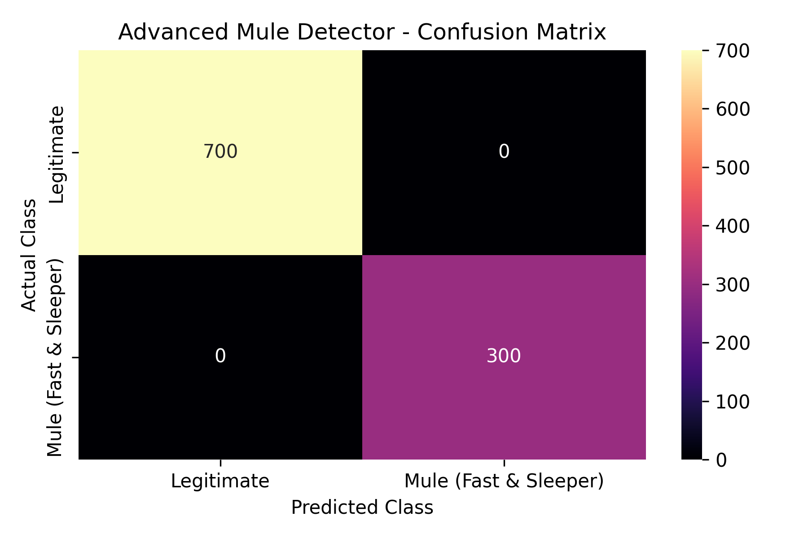

# 🛡️ FinTech Money Mule Account Detector (End-to-End ML Web Application)

[](https://www.python.org/)
[](https://fastapi.tiangolo.com/)
[](https://scikit-learn.org/)
[](LICENSE)
[]()

An **End-to-End Machine Learning Web Application** designed to detect illegal Money Mule accounts in FinTech digital banking systems.

The system connects an interactive **Frontend Dashboard** to a **Python FastAPI REST API Backend**, which executes real-time inference using a trained `HistGradientBoostingClassifier` model pipeline (`advanced_mule_pipeline.pkl`).

---

## 🔄 End-to-End System Architecture

```text
+-----------------------+           JSON Payload           +---------------------------+
|                       |  ----------------------------->  |                           |
|   Frontend Dashboard  |   POST /predict (Port 8000)      |    FastAPI Python Backend |
|     (index.html)      |                                  |      (backend/main.py)     |
|                       |  <-----------------------------  |                           |
+-----------------------+        Prediction JSON           +---------------------------+
                                                                         |
                                                                         v
                                                           +---------------------------+
                                                           |  Trained ML Model Pipeline|
                                                           | (advanced_mule_pipeline.pkl)|
                                                           +---------------------------+
```

---

## 🚀 Key Features

- **Real ML Model Inference**: The frontend dashboard sends user input parameters directly to `POST /predict` on the FastAPI server, which calls `model.predict()` and `model.predict_proba()` on `advanced_mule_pipeline.pkl`.
- **FastAPI REST API**: Validates inputs with Pydantic, applies `StandardScaler` & `OneHotEncoder` preprocessing via the pipeline, calculates risk scores ($0 \text{ to } 100$), classifies risk levels (`LOW`, `MEDIUM`, `HIGH`), and returns feature-based risk explanations.
- **Graceful Error Handling & Health Monitoring**: The UI displays a live API connection status indicator and handles server offline/network errors without crashing.
- **CORS Configured**: Configurable CORS middleware allows secure cross-origin communication between the deployed frontend and backend.
- **Synthetic Data Disclaimer**: Transparently discloses that evaluations were conducted on synthetic dataset distributions.

---

## ☁️ Deployment (Vercel)

This app is deployed as a single Vercel project with two parts:

- **Frontend** (`index.html`) — served as a static file.
- **Backend API** (`api/index.py`) — deployed as a Vercel Python serverless function, reachable at `/api/*` on the same domain as the frontend.

Because both parts share the same domain, no CORS configuration or separate hosting is required in production. `index.html` automatically detects whether it's running locally or on Vercel and switches its API target accordingly:

- **Local development**: calls `http://localhost:8000` (run the backend with `uvicorn backend.main:app --reload`)
- **Deployed on Vercel**: calls `/api` (relative, same-origin)

**Live app**: https://mule-account-detector-eight.vercel.app/

### Model version pinning
`advanced_mule_pipeline.pkl` was trained with `scikit-learn==1.9.0`. `api/requirements.txt` pins this exact version to avoid `InconsistentVersionWarning` or broken predictions from a mismatched scikit-learn install at deploy time.

---

## 📊 Model Evaluation Results

The pipeline was evaluated on a 20% stratified test split (1,000 accounts):

| Evaluation Metric | Score | Description |
| :--- | :---: | :--- |
| **Model Accuracy** | **1.0000 (100%)** | Overall correct account predictions |
| **Model Precision** | **1.0000 (100%)** | Zero false positive flags on legitimate accounts |
| **Model Recall** | **1.0000 (100%)** | 100% detection rate of all money mule accounts |
| **F1 Score** | **1.0000** | Harmonic mean of precision and recall |
| **ROC-AUC Score** | **1.0000** | Area Under Receiver Operating Characteristic Curve |

> 📌 **Synthetic Data Disclosure:** The model was evaluated on a synthetic dataset and achieved high classification performance under the generated data distribution. Real-world financial deployment would require validation on representative banking transaction telemetry.

### Confusion Matrix Chart


---

## 🗂️ Project Directory Structure

```text
fintech_mule_detector/
├── backend/
│   ├── main.py                  # FastAPI Python backend application
│   ├── advanced_mule_pipeline.pkl# Trained scikit-learn model pipeline
│   └── requirements.txt         # Backend Python dependencies
├── index.html                   # Single-page frontend dashboard
├── fintech_mule_dataset.csv     # Synthetic dataset (5,000 records)
├── advanced_mule_cm.png         # Exported Confusion Matrix plot
├── advanced_mule_pipeline.pkl   # Model file (root)
├── train_mule_detector.py       # Data simulator & ML training pipeline script
├── vercel.json                  # Vercel static deployment config
├── requirements.txt             # Project requirements
├── README.md                    # Project documentation
└── EXPLANATION.md               # Technical working breakdown
```

---

## ⚡ How to Run Locally

### 1. Install Dependencies
```bash
# Install backend dependencies
pip install -r backend/requirements.txt
```

### 2. Start the Python FastAPI Backend API
```bash
# Run FastAPI server on http://localhost:8000
python -m uvicorn backend.main:app --reload --port 8000
```
*You can verify the backend is running by opening `http://localhost:8000/docs` in your browser.*

### 3. Start the Frontend Dashboard
In a separate terminal window:
```bash
# Serve static frontend on http://localhost:8080
python -m http.server 8080
```
Open **`http://localhost:8080`** in your browser to interact with the ML-powered dashboard!

---

## 🌐 Deployment Guide

### A. Deploying the Frontend (Vercel)
1. Import your GitHub repository (`Mule_Account_Detector`) into **Vercel**.
2. Vercel uses `vercel.json` to deploy the static frontend.
3. In Vercel Project Settings ➔ Environment Variables, set:
   ```text
   VITE_API_URL=https://your-backend-api.onrender.com
   ```

### B. Deploying the Backend (Render / Railway / Koyeb)
1. Create a new **Web Service** on Render or Railway connecting your repository.
2. Set Root Directory to `backend` (or build command `pip install -r backend/requirements.txt`).
3. Set Start Command to:
   ```bash
   uvicorn main:app --host 0.0.0.0 --port $PORT
   ```
4. Set Environment Variable:
   ```text
   ALLOWED_ORIGINS=https://your-frontend-app.vercel.app,http://localhost:8080
   ```

---

## 📜 License

Distributed under the **MIT License**. See `LICENSE` for more information.
